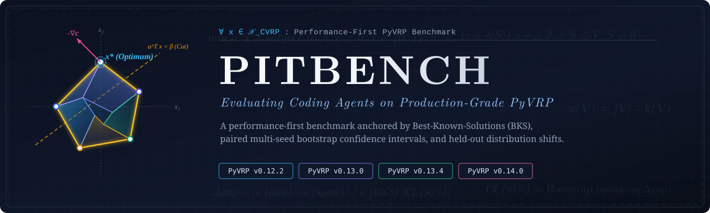

<p align="center">
  
</p>

<p align="center">
  
  
  
  
  
  
</p>

<p align="center">
  <a href="#-quickstart">
    
  </a>
  <a href="#-combinatorial-optimization-tasks-matrix">
    
  </a>
  <a href="#%EF%B8%8F-the-three-pillars-of-pitbench">
    
  </a>
  <a href="#-roadmap--future-directions">
    
  </a>
  <a href="#-citation">
    
  </a>
</p>

<p align="center">
  <b>A benchmark for evaluating whether coding agents can produce valid, statistically supported performance improvements in mature optimization solvers.</b>
</p>

---

## 🎯 Why Combinatorial Optimization (CO)?

**Combinatorial Optimization (CO)** is the algorithmic backbone of modern logistics, supply chains, manufacturing, and scheduling. Developing and accelerating high-performance solvers requires mathematical insight, intricate search heuristics, and low-level systems programming. PitBench currently focuses on four release snapshots of **PyVRP**.

Unlike general repository-level coding benchmarks, solver optimization must preserve problem semantics while evaluating a randomized quality-time process:

* 🧠 **Complex Algorithmic Search Spaces**: PyVRP relies on Hybrid Genetic Search, local search neighborhoods, population management, and adaptive control.
* ⚡ **High-Performance Hybrid Architectures**: Solvers heavily utilize C++/Python hybrid designs (e.g., C++ computational kernels exposed via Pybind11 / Cython) where minor changes can break memory invariants or cause severe algorithmic regressions.
* ⏱️ **Stochastic Quality-Time Tradeoffs**: Combinatorial search is inherently randomized. Speedup is meaningless if solution quality (optimality gap) degrades. Benchmarking must evaluate the quality-time Pareto frontier under fixed computational budgets.

**PitBench provides a problem-aware testbed for agentic performance engineering on real solver repositories.**

---

## 🌟 Key Highlights

1. **Repository-Level Solver Optimization**
   Agents modify real PyVRP release snapshots rather than isolated algorithm exercises.

2. **Four PyVRP Release Snapshots**
   The supported tasks cover PyVRP v0.12.2, v0.13.0, v0.13.4, and v0.14.0 using common instances, seeds, and budgets.

3. **CO-Specific Quality-Time Performance-First Protocol**
   Evaluates true algorithmic improvements by measuring **normalized optimality gap reductions ($\Delta \text{gap} = \text{gap}_{\text{base}} - \text{gap}_{\text{agent}}$)** against official **Best-Known-Solutions (CVRPLIB-X BKS)** under **fixed time budgets (`budget_sec` = 1s, 5s, 10s)**, paired across identical solver seeds with **5,000 instance-cluster bootstrap 95% confidence intervals**.

4. **Prepared Docker Environments**
   PyVRP native extensions are compiled in prepared, commit-tagged images. Agent execution is network-disabled, while evaluator-owned hidden assets are supplied only to a separate judge environment.

---

## 🏛️ The Three Pillars of PitBench

```
                       ┌──────────────────────────────────────────────────────────┐
                       │               PitBench Evaluation Pipeline               │
                       └────────────────────────────┬─────────────────────────────┘
                                                    │
        ┌───────────────────────────────────────────┼───────────────────────────────────────────┐
        ▼                                           ▼                                           ▼
┌───────────────────────────────┐   ┌───────────────────────────────┐   ┌───────────────────────────────┐
│   1. Quality-Time Contract    │   │  2. Randomized Repeatability  │   │  3. Held-Out Generalization   │
├───────────────────────────────┤   ├───────────────────────────────┤   ├───────────────────────────────┤
│ • Fixed budgets (1s/5s/10s)  │   │ • Multi-seed paired trials    │   │ • Evaluate on unseen instances│
│ • Anchored to optimum / BKS   │   │ • Instance-cluster bootstrap  │   │ • Retention on hidden shifts  │
│ • True Gap Reduction:         │   │ • Strict 95% confidence bounds│   │ • Check retention beyond dev  │
│   Δgap = gap_base - gap_agent │   │ • Paired seed evidence        │   │   on judge_shift              │
└───────────────────────────────┘   └───────────────────────────────┘   └───────────────────────────────┘
```

### 1. Quality-Time Performance First
- **Quality and time stay coupled**: Faster execution is not treated as an improvement when independently verified solution quality regresses.
- **Independent Solution Verifiers**: Evaluator-owned verifiers check route feasibility and capacity constraints, and recompute objective values. BKS anchors then define normalized gaps.

### 2. Randomized Repeatability & Statistical Rigor
- Metaheuristics and randomized search algorithms exhibit high variance across seeds.
- PyVRP evaluations pair Base and Agent across five solver seeds and compute **instance-cluster bootstrap 95% confidence intervals (CI95)**. An improvement claim is accepted only when the lower bound is strictly positive ($CI_{\text{lower}} > 0$).

### 3. Generalization across Problem Topologies (Held-Out Retention)
- Evaluations test both calibration instances (`judge_id`) and unseen structural shift instances (`judge_shift`, e.g., clustered customer distributions, skewed demand profiles).
- The report shows whether the measured improvement is retained on the declared hidden-shift population; it does not claim universal generalization.

---

## 📦 Combinatorial Optimization Tasks Matrix

| Task ID | Solver & Version | Problem Family | Architecture | Optimization Scope |
| :--- | :--- | :--- | :--- | :--- |
| `pyvrp_v0_12_2` | **PyVRP** v0.12.2 | CVRP | C++ / Python (Pybind11) | Search and local-search efficiency |
| `pyvrp_v0_13_0` | **PyVRP** v0.13.0 | CVRP | C++ / Python (Pybind11) | Search and local-search efficiency |
| `pyvrp_v0_13_4` | **PyVRP** v0.13.4 | CVRP | C++ / Python (Pybind11) | Search and local-search efficiency |
| `pyvrp_v0_14_0` | **PyVRP** v0.14.0 | CVRP | C++ / Python (Pybind11) | Search and local-search efficiency |

---

## 🚀 Quickstart

### 1. Installation

PitBench requires Linux, Python 3.12+, [`uv`](https://github.com/astral-sh/uv), Docker Engine, and Docker Compose.

```bash
# Clone the repository
git clone https://github.com/Tarseus/PitBench.git
cd PitBench

# Install development dependencies
uv sync --group dev
```

### 2. Validate the Public Benchmark Contract

The public repository includes task manifests, development instances, and the deterministic evaluator smoke path:

```bash
uv run pitbench tasks validate
uv run pitbench tasks smoke --instances-per-population 1
```

Fixture smoke tests validate orchestration and storage contracts; they are not real solver results.

### 3. Run a Maintainer-Provisioned Evaluation

Formal evaluation additionally requires read access to the private PyVRP images, evaluator-owned hidden assets under `private/`, and a digest-pinned judge image. Authenticate to GHCR and prepare a host agent once:

```bash
docker login ghcr.io

# Codex with a ChatGPT subscription
codex login
sudo scripts/install-codex-runner.sh

# Or Antigravity with a Google subscription
agy
sudo scripts/install-antigravity-runner.sh
```

Once those evaluator-owned inputs are provisioned, one command materializes the task, runs the agent, and starts independent judging:

```bash
uv run pitbench evaluate pyvrp_v0_14_0 \
  --agent codex \
  --model gpt-5.6-terra \
  --judge-image "$PITBENCH_JUDGE_IMAGE"

uv run pitbench evaluate pyvrp_v0_14_0 \
  --agent antigravity \
  --model gemini-3.1-pro-high \
  --judge-image "$PITBENCH_JUDGE_IMAGE"
```

### 4. Generate a Performance-First Report

Each trial stores observations under `runs/<run_id>/<task_id>/<trial_name>/evaluation/trials.parquet`. The report command accepts either that file or its containing `evaluation/` directory:

```bash
uv run pitbench report \
  runs/<run_id>/<task_id>/<trial_name>/evaluation

uv run pitbench report \
  runs/<run_id>/<task_id>/<trial_name>/evaluation --json
```

---

## 🛠️ Verification & Developer Tooling

```bash
# Validate task manifests and contracts
uv run pitbench tasks validate

# Run the deterministic evaluator fixture
uv run pitbench tasks smoke --instances-per-population 1

# Run the unit suite
ALL_PROXY= all_proxy= uv run pytest -q tests/unit
```

---

## 🧭 Roadmap & Future Directions

- [ ] **Broader Combinatorial Optimization Problem Domains**
  - [ ] **MIP & LP Tracks**: Integrate **HiGHS** cutting-plane generation and presolve heuristic optimization tasks.
  - [ ] **CP & SAT Tracks**: Integrate **Google OR-Tools** CP-SAT constraint propagation and search-tree branching tasks.
  - [ ] **Classic Integer Programming**: Support **SCIP** and **Cbc** solver tracks.
- [ ] **Advanced Sensitivity & Distributional Metrics**
  - [ ] Representation Stability: Test invariance under semantic-preserving transformations (node relabeling, coordinate shifts).
  - [ ] Problem Scale Exponents: Quantify scaling slopes ($\frac{\Delta \log T}{\Delta \log s(x)}$) across instance scale descriptors (customer counts, variables, constraints).
  - [ ] Optimal Transport Behavior Profiling: Evaluate Wasserstein distances between solver empirical behavior kernels across instance populations.
- [ ] **Hardware-Isolated Distributed Cloud Infrastructure**
  - [ ] Automated provisioning and hardware isolation on AWS EC2 bare-metal instances.
  - [ ] Distributed batch evaluation pipelines for Slurm and Kubernetes clusters.
- [ ] **Autonomous Operator Discovery in Combinatorial Optimization**
  - [ ] Evaluate LLM agents on autonomously inventing novel local search neighborhood operators (2-opt, Relocate, Swap, Ejection Chains).
  - [ ] Benchmark Large Neighborhood Search (LNS) Ruin-and-Recreate operator synthesis and heuristic adaptation.
- [ ] **Live Leaderboard & Automated Benchmark CI**
  - [ ] Launch a public web leaderboard tracking the state-of-the-art LLM coding agents on Combinatorial Optimization solvers.
  - [ ] Automated GitHub Actions CI workflow for verifying community agent submissions.

---

## 📂 Repository Layout

```
PitBench/
├── pitbench/
│   ├── harness/         # Agent execution sandbox, loopback MCP terminal & container orchestration
│   ├── evaluator/       # Isolated read-only judge (DockerJudge/FixtureJudge) & PatchPolicy
│   ├── metrics/         # PerformanceReport, Cluster Bootstrap 95% CI & decision policies
│   ├── schema/          # Pydantic data schemas (RunObservation, EvaluationResult, PitBenchTask)
│   ├── repositories/    # Solver build and execution plugins
│   ├── families/        # Independent CVRP verification
│   ├── instances/       # CO instance generation and materialization tooling
│   └── cli/             # Unified CLI entry points (`pitbench run/evaluate/report/tasks`)
├── manifests/tasks/      # Public task specifications
├── adapters/pitbench/    # Prepared PyVRP Docker adapter
├── private/              # Maintainer-provisioned hidden evaluation assets
└── tests/unit/           # Unit test suite
```

---

## 🏷️ Keywords & Topics

`combinatorial-optimization` • `operations-research` • `llm-agents` • `code-optimization` • `pyvrp` • `vehicle-routing-problem` • `performance-engineering`

---

## 📝 Citation

If you use PitBench in your research, please cite our work:

```bibtex
@misc{pitbench2026,
  title={PitBench: Performance-First Evaluation for Agents Modifying Combinatorial Optimization Solvers},
  author={Tarseus Team and Contributors},
  year={2026},
  publisher={GitHub},
  howpublished={\url{https://github.com/Tarseus/PitBench}}
}
```

---

## License

PitBench is distributed under the [BSD 3-Clause License](LICENSE). It incorporates and adapts components from FormulaCode; the original copyright notice is retained in the license file.
